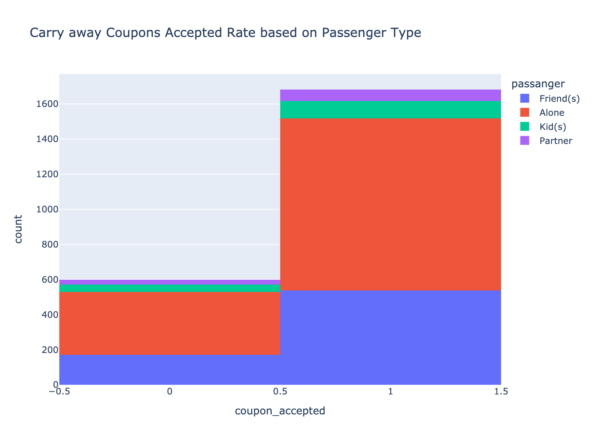

### Required Assignment 5.1: Will the Customer Accept the Coupon?

**Context**

Imagine driving through town and a coupon is delivered to your cell phone for a restaurant near where you are driving. Would you accept that coupon and take a short detour to the restaurant? Would you accept the coupon but use it on a subsequent trip? Would you ignore the coupon entirely? What if the coupon was for a bar instead of a restaurant? What about a coffee house? Would you accept a bar coupon with a minor passenger in the car? What about if it was just you and your partner in the car? Would weather impact the rate of acceptance? What about the time of day?

Obviously, proximity to the business is a factor on whether the coupon is delivered to the driver or not, but what are the factors that determine whether a driver accepts the coupon once it is delivered to them? How would you determine whether a driver is likely to accept a coupon?

**Overview**

The goal of this project is to use what you know about visualizations and probability distributions to distinguish between customers who accepted a driving coupon versus those that did not.

The Analysis of the coupons data is done at the [notebook](./coupon_analysis.ipynb)

Steps Folowed:

1. Read the data from the `coupons.csv` file provided.
2. Investigated the dataset for missing or problematic data.
3. Decide what to do about your missing data -- drop, replace, other...

    Here are the actions taken on the data:
   
       - Based on the previous data exploration phase, figured out that we may not need these columns for the analysis 'car', 'toCoupon_GEQ5min', 'toCoupon_GEQ15min', 'toCoupon_GEQ25min'
       - Since these fields have NaN values and also the no of values are less compared to the overall no of rows, we can drop them
            - Bar                       107
            - CoffeeHouse               217
            - CarryAway                 151
            - RestaurantLessThan20      130
            - Restaurant20To50          189
       - The column 'Y' is recoding the acceptance of the coupon by the user, so its better to rename it to coupon_accepted
       - For better readability/ uniformity I am renaming,
            - maritalStatus -> marital_status
            - Bar -> bar
            - CoffeeHouse -> coffee_house
            - CarryAway -> carry_away
            - RestaurantLessThan20 -> restaurant_less_than_20
            - Restaurant20To50 -> restaurant_20_to_50
       - Double checked data to make sure everything is clean and ready to use

5. What proportion of the total observations chose to accept the coupon?

   - Chose to accept the coupon : 56.93%

6. Use a bar plot to visualize the `coupon` column.

    
    
7. Use a histogram to visualize the temperature column.
   
    
    

**Investigating the Bar Coupons**

Now, we will lead you through an exploration of just the bar related coupons.  

1. Created a new `DataFrame` that contains just the bar coupons.

    - Size of the dataFrame (1913, 22)

2. What proportion of bar coupons were accepted?

    - Chose to accept the bar coupon : 41.19%

3. Compare the acceptance rate between those who went to a bar 3 or fewer times a month to those who went more.

    - Those visited less than 3: 37.27%
    - Those visited more than 3: 76.17%

    

4. Compare the acceptance rate between drivers who go to a bar more than once a month and are over the age of 25 to the all others.  Is there a difference?
    - Those visited bar more than once and age of 25 to all others: 68.98%
    - Those visited bar less than 1 or age less than 25 : 33.77%

    

6. Use the same process to compare the acceptance rate between drivers who go to bars more than once a month and had passengers that were not a kid and had occupations other than farming, fishing, or forestry.
    
    - Those visited bar more than once and passengers were not kids and occupation other than farming, fishing, or forestry : 70.94%
    - Those who doesn't match the criteria : 29.79%
      
    

7. Compare the acceptance rates between those drivers who:

- go to bars more than once a month, had passengers that were not a kid, and were not widowed *OR*
- go to bars more than once a month and are under the age of 30 *OR*
- go to cheap restaurants more than 4 times a month and income is less than 50K.

    - Those go to bars more than once a month, had passengers that were not a kid, and were not widowed OR 
         go to bars more than once a month and are under the age of 30 OR 
         go to cheap restaurants more than 4 times a month and income is less than 50K : 47.71%
    - Those who doesn't match the criteria : 31.71%

    

7.  Based on these observations, what do you hypothesize about drivers who accepted the bar coupons?

    - The drivers, who were not having kids as passengers and occupation other than farming, fishing, or forestry and age anove 25 has higher chance to accept bar coupons

## Independent Investigation

Using the bar coupon example as motivation, you are to explore one of the other coupon groups and try to determine the characteristics of passengers who accept the coupons.  

### Investigating the Carry out & Take away Coupons

1. Created a new `DataFrame` that contains just the bar coupons.

    - Size of the dataFrame : (2280, 22)

2. What proportion of carry away coupons were accepted?

    - Chose to accept the Carry away coupon : 73.77%

3. Carry out & Take away Coupons Accepted Rate based on Passenger Type

    

4. No of times Carry out & Take away Coupons Accepted

    

5. Carry Away Coupons Accepted Rate by Time

    

6. Added a new column to the carry_away_coupon_data to indicate if the person never did carry away a month or more

    

7. Carry out & Take Away Coupons Accepted Rate if the passenger is either Friend(s) or Alone

    - Those accepted Carry Away coupons who are Alone or with Friend(s) : 74.14%
    - Those accepted Carry Away coupons who are not Alone or with Friend(s) : 70.51%

    

8. Carry out & Take away Coupons Accepted Rate based on Expiration and Direction of Travel

    - expiration
         - 1d    0.785612
         - 2h    0.662921

    

9. Carry out & Take away Coupons Accepted Rate based on Travel in Same Direction

    - direction_same
         - 0    0.753614
         - 1    0.705805

    

10. Carry out & Take away Coupons Accepted Rate based on travel in Same Direction and Expiration

    - expiration
         - 1d    0.771513
         - 2h    0.653207

    

11. Carry out & Take away Coupons Accepted Rate based on Travel in Opposite Direction

    - direction_opp
         - 0    0.705805
         - 1    0.753614

    

12. Carry out & Take away Coupons Accepted Rate based on travel in Opposite Direction and Expiration

    - expiration
         - 1d    0.790123
         - 2h    0.671642

    

#### Conclusion: 
##### 1. The drivers, who travel alone have higher chances of accepting the Carry Away coupon, then who are with friends.
##### 2. The drivers, once they accept the coupon there is higher chance they gonna use it.
##### 3. at 2PM, less likely to have accept the coupons
##### 4. Coupons of expiration of 1 day have higer chance of acceptance, especially when they are travelling in opposite direction

